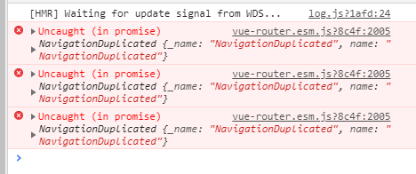

<h3>9号，早上是阴天</h3>
<h4>函数柯里化</h4>
普通函数

```bash
function add(a,b){
  return a+b
}
add(1,2)
```
柯里化函数
```bash
function add(a){
  return function(b){
    return a+b
  }
}
add(1)(2);
```
维基百科上说道：柯里化，英语：Currying(果然是满满的英译中的既视感)，是把接受多个参数的函数变换成接受一个单一参数（最初函数的第一个参数）的函数，并且返回接受余下的参数而且返回结果的新函数的技术。<br>
就是多个形参的函数转化为一个形参的函数！
<h5>用处1:复用</h5>
普通的函数，计算1+2，1+3时，我们写：<br>
add(1,2);<br>
add(1,3);<br>
柯里化函数：<br>
let fun1 = add(1)<br>
fun1(2);<br>
fun1(3);<br>
对于越复杂的程序来说，越能看出强大！<br><br><br>

<h3>10号，早上是多云</h3>
<h4>Array.prototype.slice.call(arguments)</h4>
这个方法返回一个新数组，能将具有length属性的对象(key值为数字)转成数组。

```bash
let obj = {
  0:'a',
  1:'b',
  2:'c',
  length:3
}
console.log(Array.prototype.slice.call(obj,0))
//["a", "b", "c"]
```
<h4>reduce</h4>
js 数组的reduce方法，累加数组，最后加上初始值initValue

```bash
var arr = [1,2,3,4,5]
var initValue = 0;
function add(currentSum,item){
  return currentSum + item
}
let sum = arr.reduce(add,initValue)
console.log(sum)
// 15
```

<h3>11号，没上班不知道什么天气</h3>
<h4>console对象</h4>

```bash
//console.log()占位符
%s 字符串
%d 整数
%i 整数
%f 浮点数
%o 对象的链接
%c CSS格式字符串

//example 1
var number = 11 * 9;
var color = 'red';
console.log('%d %s balloons', number, color);
// 99 red balloons
//console.log方法的第1个参数('%d %s balloons')有2个占位符（%d %s），第2、3个参数会在显示时，依次替换掉这个2个占位符

example 2
console.log('%c This text is styled!',
  'color: red; background: yellow; font-size: 24px;'
)
//上面代码运行后，输出的内容将显示为黄底红字。
```
<h5>对console对象进行重写</h5>

```bash
['log', 'info', 'warn', 'error'].forEach(function(method) {
  console[method] = console[method].bind(
    console,
    new Date().toISOString()
  );
});
console.log("时间！");
VM28:8 2019-08-09T06:44:50.302Z 时间！
```

<h5>console.table()</h5>
以表格的形式显示数据,但是复合型数据转为表格显示的条件是，必须拥有主键。
<h5>console.count()</h5>
计数，执行次数
<h5>console.time()，console.timeEnd()</h5>
计算时间间隔
<h5>console.profile()，console.profileEnd()</h5>
性能查看


<h3>14号，早上是晴天</h3>
<h4>vue router 报错： Uncaught (in promise) NavigationDuplicated {_name:""NavigationDuplicated"... 的解决方法</h4>

更新下路由或者在main.js加上几行代码

```bash
import Router from 'vue-router'
const originalPush = Router.prototype.push
Router.prototype.push = function push(location) {
  return originalPush.call(this, location).catch(err => err)
}
```
出现这个问题的原因是跳转到相同路由造成的!

<h3>16号，早上是晴天，打了狂犬疫苗身体不太好</h3>
<h4>解构赋值</h4>
这个是比较常见的

```bash
let arr = [,1,2]
let [a='我是默认值',b,c] = arr  //arr[0]=undefined时才会用默认值， null不会用默认值
console.log(a) // '我是默认值'
console.log(b) // 1
console.log(c) // 2
```
下面这个是比较好用的，当时我也看不懂，高端优雅

```bash
let {a,b} = this
//等价于
let a = this.a
let b = this.b
```
